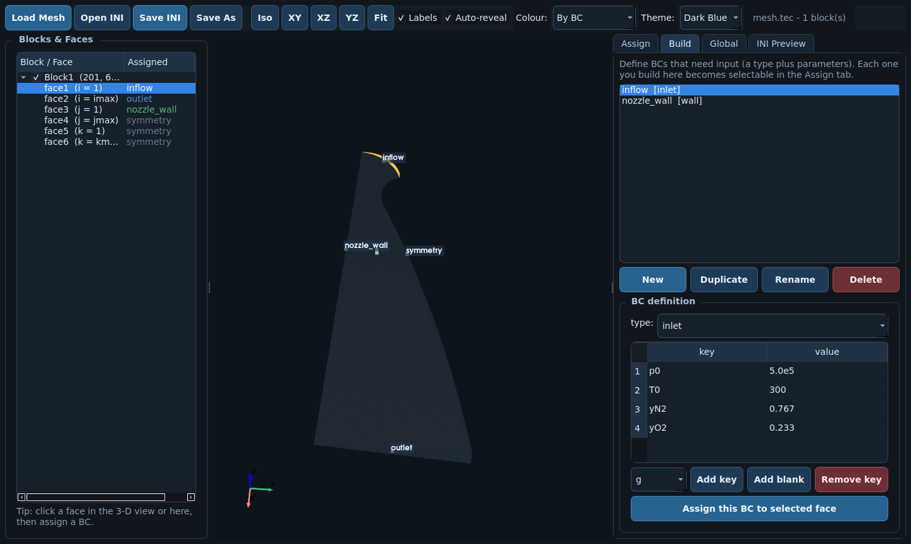

# BCB GUI

The **BCB GUI** is an interactive desktop tool for assigning boundary conditions
to a multiblock structured mesh. Load a mesh, click a block face, assign a BC,
and export a solver-ready `input.ini` — no hand-editing of face numbers required.


!!! tip "When to use it"
    The GUI writes exactly the same `input.ini` described in
    [BC Setup](./bc-setup.md). Use it to build a case visually or to inspect and
    edit an existing one; power users can still edit the INI by hand.

---

## Launching

The GUI runs in the `ct-env` conda environment (it needs `pyqt`, `pyvista` and
`pyvistaqt`, which are listed in `ct-env.yaml`):

```bash
ATLAS BCB-GUI
```

or directly:

```bash
python utils/ATLAS/GUI/BCB_GUI.py [mesh] [--ini input.ini]
```

If the GUI dependencies are missing, refresh the environment with
`conda env update -f utils/ATLAS/ct-env.yaml`.

---

## Loading a mesh

Use **Load Mesh** to open a grid in either format:

| Format | Extensions | Notes |
|--------|-----------|-------|
| Tecplot ASCII | `.tec`, `.dat` | single- or multi-zone, `BLOCK`/`POINT` packing |
| Plot3D (formatted) | `.p3d`, `.xyz`, `.g` | multiblock, 2-D or 3-D (auto-detected) |

Only nodal coordinates are read, so field/solution files load fine too. Each
block is split into its six faces following the fixed BCB numbering
(`face1: i=1`, `face2: i=imax`, …, `face6: k=kmax`). For 2-D / planar blocks
only faces 1–4 are assignable; BCB fills faces 5/6 automatically.

---

## Navigating the view

- **Rotate / pan / zoom** with the mouse (left-drag / middle-drag / wheel).
- **Iso / XY / XZ / YZ / Fit** buttons jump to preset views.
- The **Blocks & Faces** tree lists every block and face. Its first checkbox
  toggles block **visibility**; the **Ghost** checkbox makes a block transparent.
- **Auto-reveal** (on by default) makes surrounding geometry transparent while a
  face is selected, so a covered face stays visible.
- **Colour** switches face colouring between *by BC* and *by block index*.
- **Theme** selects the colour theme (Dark Blue, Graphite, Nord, Light); the
  choice is remembered between sessions.

---

## Assigning boundary conditions

Boundary conditions come in two kinds, matching the INI format:

=== "Assign — keyword BCs"

    Click a face (in the 3-D view or the tree), then pick a **no-input keyword
    BC** — `symmetry`, `outlet`, `extrapolation`, `connection`, `chimera`,
    `null`, `axisymmetric`. These are written straight onto the face line and
    need no section.

=== "Build — BCs with input"

    In the **Build** tab, define a named BC with a `type` (`wall`, `inlet`,
    `outlet`, `manifold`, `srm`, `periodic`) and its parameters. Each BC you
    build becomes selectable in the Assign tab. Parameter keys can be picked
    from per-type suggestions or typed freely (any `key = value` is allowed),
    which covers spatially-varying and `*-file` inputs.



Assigned faces are coloured and labelled in the 3-D view, and shown next to each
face in the tree.

---

## Exporting

**Save INI** (or **Save As**) writes the `input.ini`:

- `[ATLAS-Parameters]` from the **Global** tab (e.g. `MG-levels`, `BC-chimera`);
- one `[BCB-BlockN]` per block mapping `face1…faceN`;
- a `[name]` section for each referenced built BC.

The **INI Preview** tab shows the exact file live as you edit. If any face is
left unassigned the GUI warns before saving (BCB requires every face to be
mapped).

---

## Next

- [BC Setup](./bc-setup.md) — the full `input.ini` reference.
- [BC Types](./bc-types.md) — parameters accepted by each BC type.
