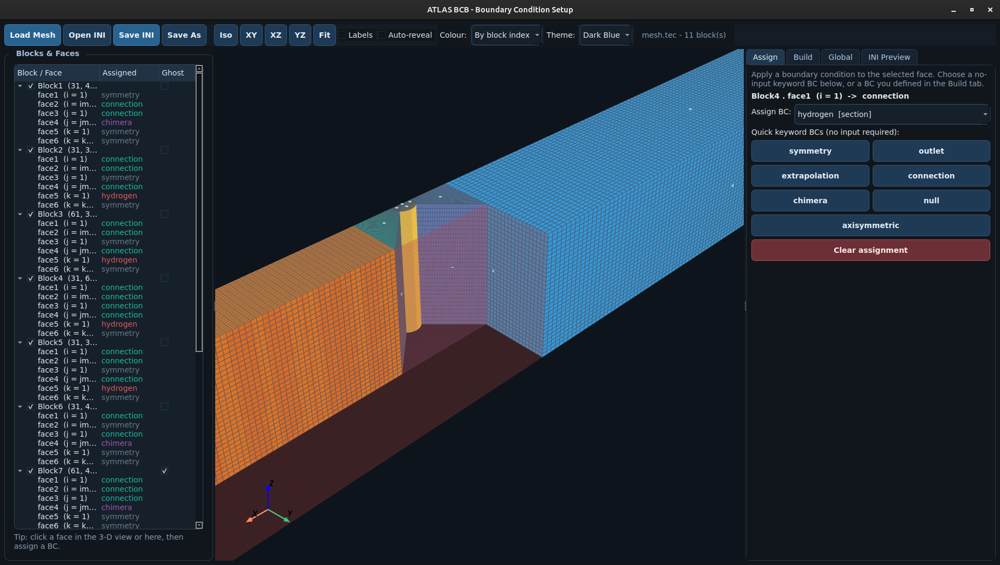

# BCB — Boundary Condition Builder

BCB assigns boundary conditions to block faces and writes solver-ready BC files.

It supports simple single-patch boundaries, multipatch definitions, periodic links, standard block connections, and chimera/overset connectivity workflows.

!!! tip "BCB in the Hydra workflow"
    BCB is designed to be used in the Hydra workflow. It consumes mesh and phase information built by other tools, and produces BC files for use by all Hydra solvers.

!!! example "Prefer a visual workflow?"
    The interactive [BCB GUI](./gui.md) lets you load a mesh, click block faces,
    assign boundary conditions, and export the `input.ini` directly. Launch it
    with `ATLAS BCB-GUI`.

    [](./gui.md)

---

## BC Types

<div class="grid cards" markdown>

-   :material-arrow-right-bold: **Inlet / Outlet**

	---

	For pressure, mass-flux, and time-varying inflow/outflow models in IG and DP setups.

-   :material-wall: **Wall**

	---

	Thermal wall definitions for fluid and solid phases: heat flux, temperature, radiative/convective forms.

-   :material-shape: **Physics-Based**

	---

	Dedicated BC models for physical boundary behavior.

-   :material-link-variant: **Connection / Periodic**

	---

	Face-to-face coupling between blocks, including periodic pairing through explicit face mapping.

-   :material-vector-intersection: **Chimera**

	---

	Overset-grid connectivity with donor/receiver interpolation payloads.

	[Requirements and limits](./connectivity.md)

-   :material-shape: **Multi-solver**

	---

	BC building blocks for multi-solver coupling frameworks.

</div>

Use the full reference in [BC Types](./bc-types) for summary tables and INI syntax examples for each type.

## Workflow

0. Provide the required files, mesh and phase information.
1. Open a file and save it with an `.ini` extension (for example `input.ini`).
2. For each grid block, define a BCB-BlockN section and map face1..face6 to BC section names.
3. Define each BC section (for example inlet, outlet, wall, periodic pair).
4. Run BCB with the BCB INI file as input (if none is specified, it will use the default `input.ini`). Generated files are in `fromATLAStoSolver/`.
```bash
ATLAS BCB --input input.ini
```

## References

- [Required files](./required-files)
- [BC Setup](./bc-setup)
- [BCB GUI](./gui)
- [BC Types](./bc-types)
- [Output Files](./output)
- [Input Reference](./input-reference)

See the [tutorials](/tutorials/bcb/) for worked examples.

## Next

- [BC Setup](./bc-setup.md)